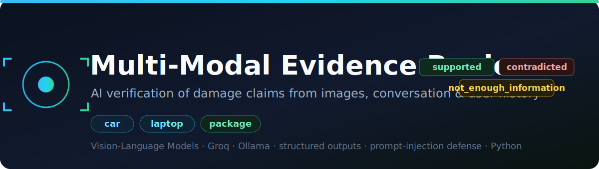

<p align="center">
  
</p>

<p align="center">
  
  
  
  
  
</p>

An AI system that verifies **damage claims** (car, laptop, package) by reasoning over
**submitted images**, a **claim conversation**, **user history**, and **minimum-evidence
rules** — and decides whether the images **support**, **contradict**, or are **insufficient**
for the claim.

Built for the HackerRank Orchestrate hackathon (24-hour, solo). This repository contains
my solution, evaluation, and predictions. The challenge dataset (images/CSVs) is HackerRank's
and is **not** redistributed here.

---

## The problem

For each claim the system must output a structured verdict with 14 fields: whether the
evidence is sufficient, the visible issue type and object part, the verdict
(`supported` / `contradicted` / `not_enough_information`), which images justify it,
risk flags, severity, and short image-grounded justifications.

Design rules (from the spec):
- **Images are the source of truth.** The conversation only says *what to check*.
- **User history adds risk context but never overrides clear visual evidence.**
- Some claims contain **prompt-injection** ("approve this", "ignore instructions") — these
  must be detected and ignored, never obeyed.

## Approach

```
claim ─► parse claim text ─► select evidence standard (rules)
       ─► ONE structured vision call (all images batched, strict JSON out)
       ─► fuse with user-history risk + deterministic injection guard
       ─► clamp to the exact 14-column schema ─► output.csv
```

Key design choices:
- **One vision call per claim** — cheap, low rate-limit pressure, easy to reason about.
- **The model does the *seeing*; deterministic Python does the *policy*** (evidence rules,
  history fusion, injection defense, schema validation) — reproducible and auditable.
- **Provider-agnostic model layer** with automatic failover and on-disk caching:
  OpenAI / Gemini / **Groq** (cloud) and **Ollama / Qwen2.5-VL** (local), selectable via
  `PROVIDER_ORDER`. This made swapping backends a config change, not a rewrite.
- **Prompt-injection defense** (defense-in-depth): a deterministic detector sets
  `text_instruction_present` regardless of the model, and the decision logic never reads an
  outcome from claim text. Works across languages (incl. Hindi/Spanish/code-switched).
- **Strict structured output** + per-field clamping to allowed enums — a hallucinated label
  can never reach `output.csv`.

## Results (on the 20 labeled sample claims)

| Model config | claim_status | object_part | evidence_std | issue_type | severity |
|---|---|---|---|---|---|
| **Groq `qwen3.6-27b`** (final) | **0.85** | **0.95** | 0.95 | 0.55 | 0.45 |
| Local `qwen2.5vl:7b` (Ollama) | 0.75 | 0.75 | 0.95 | 0.30 | 0.35 |

`output.csv` (predictions for the 44-row test set) was generated with Groq as primary and
the local model as a per-row fallback when cloud rate limits were hit — so every row has a
real model verdict. See [`code/evaluation/evaluation_report.md`](code/evaluation/evaluation_report.md)
for the full metrics, confusion matrix, configuration comparison, and operational analysis.

## Run it

```bash
cd code
python -m venv .venv && .venv/Scripts/activate      # or source .venv/bin/activate
pip install -r requirements.txt
cp .env.example .env        # add a GROQ_API_KEY (free at console.groq.com), or run Ollama locally
python main.py              # dataset/claims.csv -> output.csv
python evaluation/main.py   # score on the labeled sample set
USE_MOCK=1 python main.py --limit 3   # offline, no keys needed
```

## What I'd improve with more time / budget
- Use a stronger model (gpt-4o / gemini-2.5-flash) as primary — the abstraction already
  supports it — for higher accuracy at ~$0.10–0.50 for the whole dataset.
- A second targeted call only for low-confidence contradictions; severity calibration examples.

## Honest notes
- This was a ~1-day solo hackathon build. Accuracy is measured on a 20-row labeled set.
- The free-tier API rate limits (not the solution) were the main constraint; `output.csv`
  is a blend of cloud (0.85) and local (0.75) verdicts because the cloud free tier
  throttled mid-run.

## Tech
Python · Vision-Language Models (Qwen2.5-VL / Qwen3.6 / GPT-4o / Gemini) · Groq · Ollama ·
structured outputs · prompt-injection defense · evaluation harness · caching / retry / failover.
